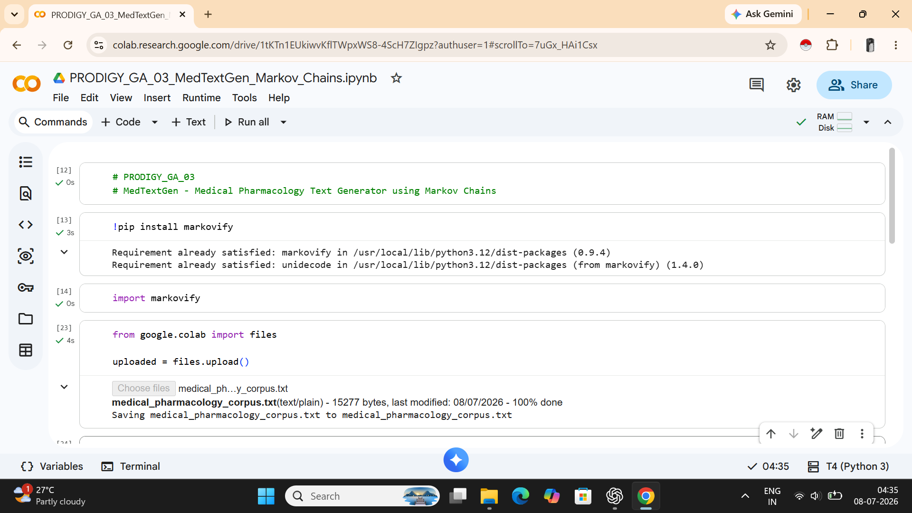
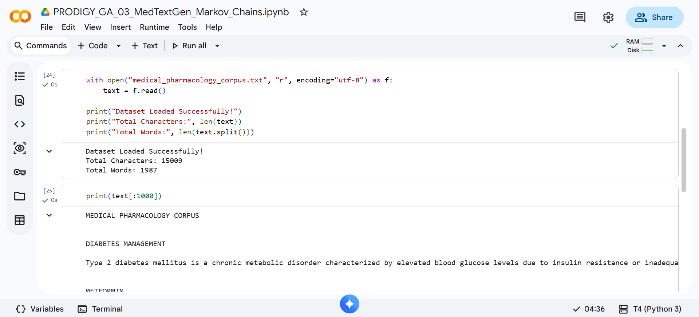
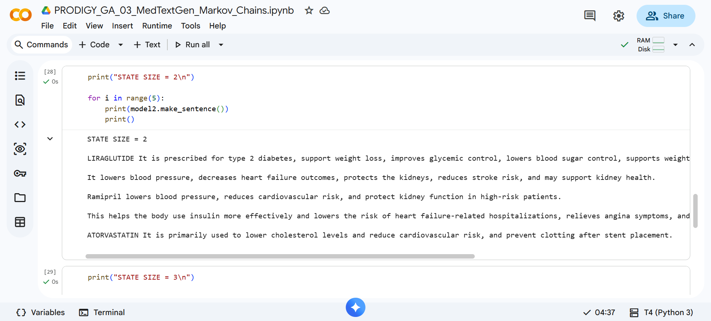
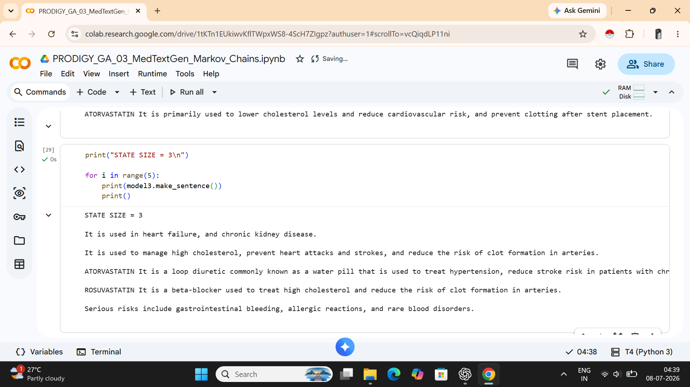
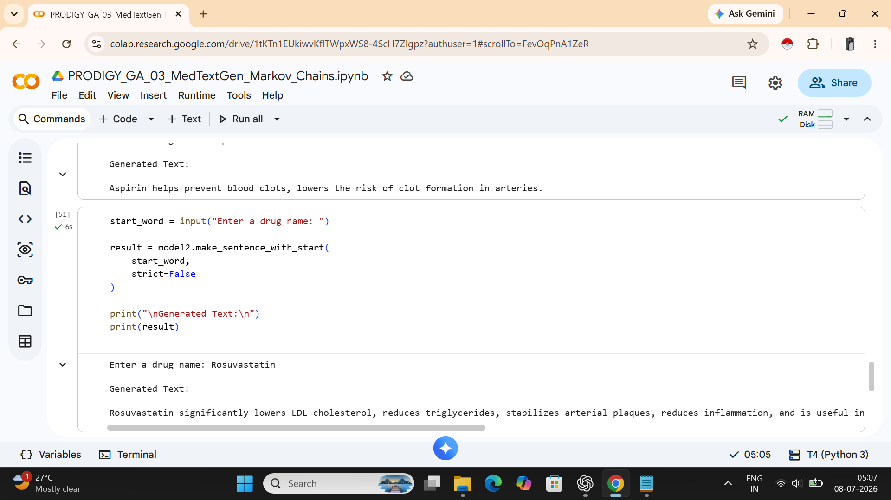

# PRODIGY_GA_03

## Task 03 - Generative AI Internship @ Prodigy InfoTech

## Medical Pharmacology Text Generator using Markov Chains

## Overview

This project demonstrates a healthcare-focused text generation system built using Markov Chains. A custom pharmacology corpus was created containing information about medications used in diabetes management, heart failure treatment, and cardiovascular risk reduction.

The model learns word transition patterns from the dataset and generates new pharmacology-related sentences from user-provided drug names.

This project showcases how probabilistic language models can generate domain-specific medical text without requiring deep learning or large language models.

## Project Objective

Develop a domain-specific text generation system capable of generating coherent pharmacology-related text from a custom healthcare corpus using Markov Chains.

## Dataset

Custom medical pharmacology corpus containing:

18 medication profiles

15,009 characters

1,987 words

## Topics Included

### Diabetes Management

- Metformin
- Empagliflozin
- Dapagliflozin
- Semaglutide
- Tirzepatide
- Liraglutide

### Heart Failure Treatment

- Sacubitril/Valsartan
- Carvedilol
- Bisoprolol
- Spironolactone
- Furosemide
- Ivabradine

### Cardiovascular Risk Reduction

- Aspirin
- Atorvastatin
- Clopidogrel
- Ramipril
- Losartan
- Rosuvastatin

## Technologies Used

- Python
- Markovify
- Google Colab

## Model Details

- Algorithm: Markov Chain Text Generation
- Library Used: Markovify
- State Sizes Evaluated: 2 and 3
- Input Method: User-provided drug name
- Output: Pharmacology-related generated text

## Project Workflow

1. Created a custom pharmacology corpus covering multiple therapeutic areas.
2. Loaded and preprocessed the dataset.
3. Built Markov Chain models using Markovify.
4. Evaluated different state sizes for text generation.
5. Generated pharmacology-related text from drug name prompts.
6. Compared generated outputs for coherence and relevance.

## Results

- Successfully generated healthcare-focused text using Markov Chains.
- Produced pharmacology-related content from user-provided drug names.
- Demonstrated domain-specific text generation without deep learning models.
- Evaluated text generation performance using multiple state sizes.
  
## Sample Input

Rosuvastatin

## Sample Generated Output

Rosuvastatin significantly lowers LDL cholesterol, reduces triglycerides, stabilizes arterial plaques, and reduces inflammation.

## Repository Structure

PRODIGY_GA_03
│
├── screenshots/
│   ├── task3_project_setup.png
│   ├── task3_dataset_loading.png
│   ├── task3_markov_state2.png
│   ├── task3_markov_state3.png
│   └── task3_text_generation_demo.png
│
├── .gitignore
├── LICENSE
├── medical_pharmacology_corpus.txt
├── PRODIGY_GA_03_MedTextGen_MarkovChains.ipynb
├── requirements.txt
└── README.md

## Screenshots

### Project Setup

### Dataset Loading

### Markov Model (State Size 2)

### Markov Model (State Size 3)

### Text Generation Demo

